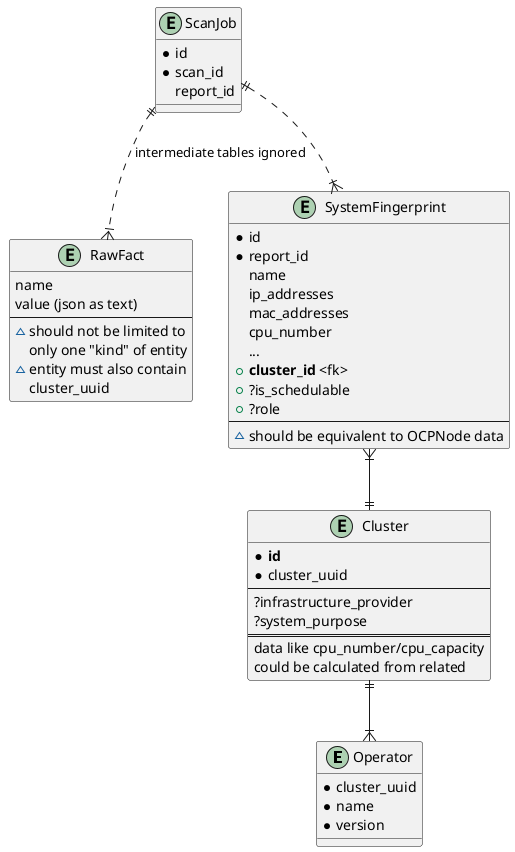

Poor man representation of OCP data
![[OCP-Entities.excalidraw|100%]]
Not sure if operators always run as pods (as long they are available on the api, it doesn't matter).
The relationship between namespaces and pods are abridged here for brevity.

```plantuml
!theme plain

entity hub as "Hub?" {
   placeholder for multicluster hub (RHCAM?)
}

entity cluster as "Cluster" {
    *cluster_uuid
}

entity node as "Node" {
    *cluster_uuid
    --
    hostname
    ipaddresses
    cpu_count
    etc...
}

entity namespace as "Namespace" {
    *cluster_uuid
    *name
    labels
}

entity operator as "Operator" {
    *cluster_uuid
    *name
    *version
}

entity controller as "App/Controller?" {
    *name
    kind (Deployment, StatefulSets, Job, ReplicaSet, etc...)
    *container_images
    labels
    
}

hub ||--|{ cluster
node }|--|| cluster
cluster ||--|{ namespace
cluster ||--|{ operator
operator }o..o{ namespace
namespace ||--o{ controller
```

### About controllers
https://kubernetes.io/docs/reference/generated/kubernetes-api/v1.26/#podtemplatespec-v1-core
># **WORKLOADS**
> 
> Workloads resources are responsible for managing and running your containers on the cluster. [Containers](https://kubernetes.io/docs/reference/generated/kubernetes-api/v1.26/#container-v1-core) are created by Controllers through [Pods](https://kubernetes.io/docs/reference/generated/kubernetes-api/v1.26/#pod-v1-core). Pods run Containers and provide environmental dependencies such as shared or persistent storage [Volumes](https://kubernetes.io/docs/reference/generated/kubernetes-api/v1.26/#volume-v1-core) and [Configuration](https://kubernetes.io/docs/reference/generated/kubernetes-api/v1.26/#configmap-v1-core) or [Secret](https://kubernetes.io/docs/reference/generated/kubernetes-api/v1.26/#secret-v1-core) data injected into the container.
> The most common Controllers are:
> -   [Deployments](https://kubernetes.io/docs/reference/generated/kubernetes-api/v1.26/#deployment-v1-apps) for stateless persistent apps (e.g. HTTP servers).
> -   [StatefulSets](https://kubernetes.io/docs/reference/generated/kubernetes-api/v1.26/#statefulset-v1-apps) for stateful persistent apps (e.g. databases).
> -   [Jobs](https://kubernetes.io/docs/reference/generated/kubernetes-api/v1.26/#job-v1-batch) for run-to-completion apps (e.g. batch Jobs).
https://kubernetes.io/docs/reference/generated/kubernetes-api/v1.26/#-strong-workloads-apis-strong-


## OCP on Discovery 1.1.0

```plantuml
entity scanjob as "ScanJob" {
    *id
    *scan_id
    report_id
}

entity raw as "RawFact" {
    name
    value (json as text)
    --
    each RawFact is holding data 
    for a namespace including
    everything collected whithin
    it (equivalent to **OCPProject**
    dumped in value)
}

entity report as "Report" {
    *id
    created_at
    --
    Details+Deployment report
}

entity fp as "SystemFingerprint" {
    *id
    *report_id
    name
    ip_addresses
    mac_addresses
    cpu_number
    ...
    **container_images**
    **container_labels**
    --
    holds deduplicated container 
    images/labels for containers
    in a namespace
}

scanjob ||..|{ raw : intermediate tables ignored
scanjob ||--|| report
report ||--|{ fp

```

- [OCPProject entity](https://github.com/quipucords/quipucords/blob/f2c84470d9d733693300656711430a03ecb167b3/quipucords/scanner/openshift/entities.py#L24-L31) contains deployments -> container images 
- introduced *container_images/container_labels* columns in QPC modeling.
- `Namespace` ~ `SystemFingerprint`

### 1.1.0 issue with "apps"

OCPProject containing only Deployments was at best an incomplete modeling. The intention was that each project would contain "apps/controllers" under them.
Here's some ideas on how to handle it:
- Get all controller types (see [[#About controllers |this]])
- Collecting all "controller" types might be a pain, because the list is huge. Specially if its something we don't want. Might be easier just grab info from running pods and deduplicate later.
```
% oc get pod --all-namespaces -o json | jq '.items[] | {"pod_name": .metadata.name, "namespace": .metadata.namespace, "containers": .spec.containers[] | {image, name}}' | head
```

## Updated OCP modeling for Discovery 1.next




- **OCPProject** position as "system" is replaced with **OCPNode**
    - in the future we can evaluate adding [kubevirt Virtual Machines](https://cloud.redhat.com/blog/a-first-look-at-kubevirt) 
- OCP entities tweaks
    - they SHOULD have a "kind" attribute (inspired on kubernetes resource naming convention), which will be used to decide which class should be used on deserialization
    - they PROBABLY will need **cluster_uuid** for multicluster support
    - the changes above could be implemented/enforced through a abstract class
    - these changes will allow saving any type of entity to `RawFact` **model**
- Namespaces/deployments/container images don't necessarily need to be removed; we can keep collecting this data but leaving it only on RawFacts (IoW, they will appear on details reports but no in deployment reports)
